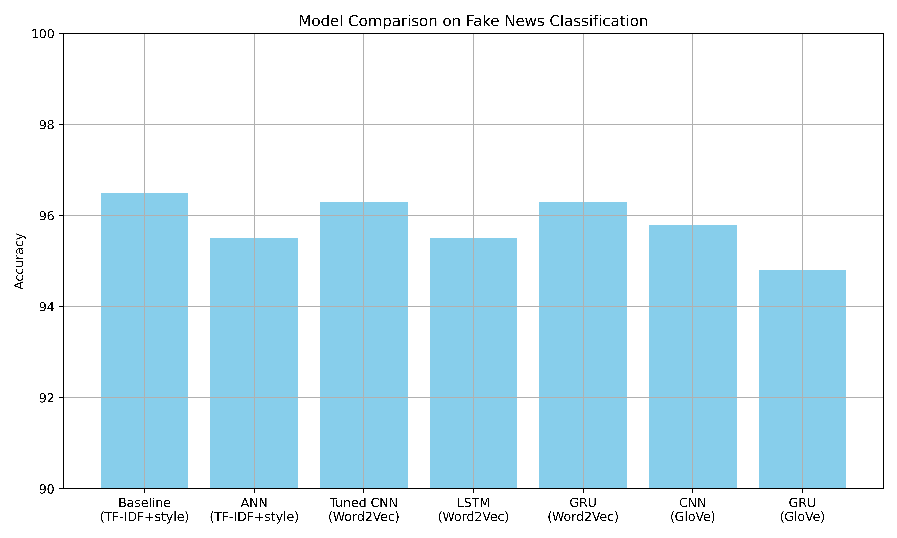

# Fake News Classification
This project explores the problem of classifying news articles as *fake* or *real* using Natural Language Processing (NLP). The approach is progressive, starting with exploratory analysis, preprocessing, and baseline machine learning models, and advancing to stronger neural network-based models, including CNNs, LSTMs, and Transformers.

## Dataset
* Source: [Hugging Face](https://huggingface.co/datasets/Reyansh4/Fake-News-Classification)
* Size: 20800 rows
* Features: `title`, `author`, `text`
* Target: `label` (0:Real, 1:Fake)

## Workflow
### 1. Data Preprocessing
* Handle missing values and duplicates
* Clean text (normalize quotes, expand contractions, strip punctuation and whitespace, normalize case)
* Tokenization and lemmatization using **NLTK**

### 2. Exploratory Analysis & Feature Extraction
* Class distribution
* Most frequent unigrams, bigrams, and trigrams
* Word clouds for Fake vs Real news articles
* Stylometric features (16 features):
    * **Lexical:** average word length, vocabulary richness
    * **Syntactic:** average sentence length, punctuation ratios, POS ratios
    * **Readability:** Flesch Readability Ease Score

### 3. Baseline Models
* Feature extraction: **TF-IDF** (50k features)
* Models tested:
    * Logistic Regression
    * Naive Bayes
    * Linear SVC (Support Vector Classifier)
* Experiments conducted with and without stylometric features
* **Results:** 
    * TF-IDF only:
        - Logistic Regression Accuracy: **94.6%**
        - Naive Bayes Accuracy: **89.6%**
        - Linear SVC Accuracy: **96.3%**
    * TF-IDF + Custom Stylometric features:
        - Logistic Regression Accuracy: **94.7%**
        - Naive Bayes Accuracy: **92.1%**
        - Linear SVC Accuracy: **96.5%**
> ✅ **Linear SVC** with stylometric features performed best. This serves as the **baseline** for comparison with neural network models.

### 4. Artificial Neural Network (ANN)
* ANNs with 3 FCs (fully-connected layers) trained on both TF-IDF features alone and combinations of TF-IDF and the custom stylometrics features
* L2 Regularization and Dropouts are used
* **Results**:
    * Accuracy (TF-IDF only): **95.3%**
    * Accuracy (TF-IDF + Stylometric Features): **95.4%**
    * Very long training time taken
> 🔍 TF-IDF features are sparse, high-dimensional inputs and neural networks don't work well on them unless we apply dimensionality reduction first.

### 5. Word Embeddings
* A **Word2Vec** model is trained on the training set to obtain **task-specific embeddings**
* Simple CNN model is used to **tune hyperparameters** (embedding dimension, context window size, maximum input length) efficiently
* **Result:** 
    * Embedding dimension = 500
    * Context window size = 5
    * Maximum input length = 588 (90th percentile length)
> ✅ These embeddings and inputs are later used in more complex CNN, LSTM, and Transformer models.

### 6. Convolutional Neural Networks (CNNs)
* CNNs capture **local phrase-level patterns** but cannot model long-term sequential dependencies like LSTMS or Transformers
* A **1D convolutional kernel of size n** acts as an **n-gram detector**
* CNNs of 3 different depths (1/2/3 convolutional layers) are tuned to find the best **hyperparameters** (filters, kernel sizes, dense layer units, dropout rate, and learning rate)
* **Results:**
    * Accuracy: **96.3%**
    * Best hyperparameters:
        - Number of Convolutional layers: 1
        - Trainable Embeddings: True (unfrozen -> fine-tuned)
        - Filters: 512
        - Kernel size: 4
> ✅ This tuned CNN serves as the **neural network benchmark** for comparison with sequential models.

### 7. Long-Short-Term Memory (LSTM) Models
* Implemented an LSTM model using the custom, task-specific embeddings, as a sequential benchmark
* Noted significantly higher training time compared to CNNs, even with limited epochs
* Initial runs (with arbitrary hyperparameters) done with frozen and unfrozen embeddings
* **Results:**
    * Embeddings `Trainable=False` - Accuracy: **~95.5%**
    * Embeddings `Trainable=True` - Accuracy: **93.5%**

### 8. Gated Recurrent Unit (GRU) Models
* Implemented a GRU model using the custom, task-specific embeddings, as a sequential benchmark
* Noted faster training compared to LSTMs
* Initial runs (with arbitrary hyperparameters - *same as those used in LSTM model*) done with frozen and unfrozen embeddings
* **Results:**
    * Embeddings `Trainable=False` - Accuracy: **96.3%**
    * Embeddings `Trainable=True` - Accuracy: **~96%**

### 9. Transfer Learning with Pretrained Embeddings
* Used pretrained GloVe embeddings
    * Wikipedia + Gigaword 2024
    * 100D vectors
* Trained the CNN and GRUs classifiers with fine-tuned embedding layers
* **Results:**
    * CNN Accuracy: **95.8%**
    * GRU Accuracy: **94.8%**

### Conclusion 
* Classical ML models (Linear SVC), using TF-IDF + custom stylometric features, performed competitively with deep learning models on this dataset, even narrowly outperforming them.
* CNN with fine-tuned, custom Word2Vec embeddings and GRU with frozen, custom Word2Vec embeddings roughly matched the baseline performance but didn't beat it.
* Pretrained embeddings underperformed compared to custom Word2Vec embeddings, likely due to domain mismatch (news-specific language vs. general-purpose embeddings), and also because GloVe vectors were 100D compared to the 500D Word2Vec vectors.

### Summary of Model Comparison

### ⏭️ Next Steps
* Transformer-based architectures (e.g., BERT) for state-of-the-art performance